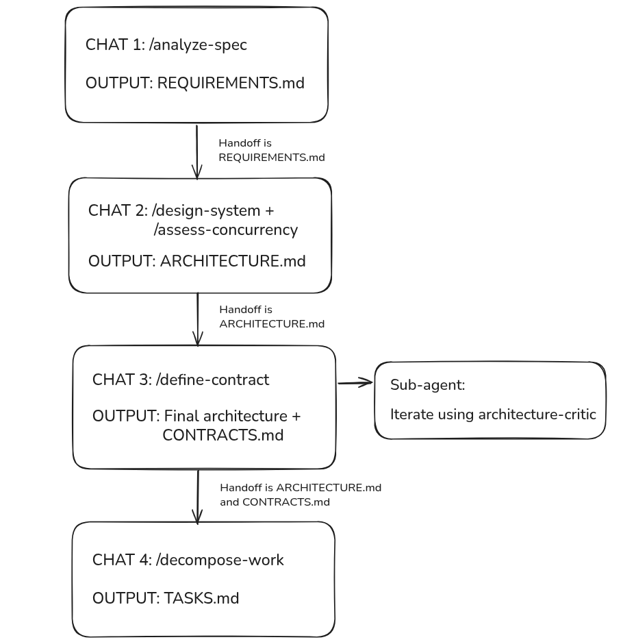
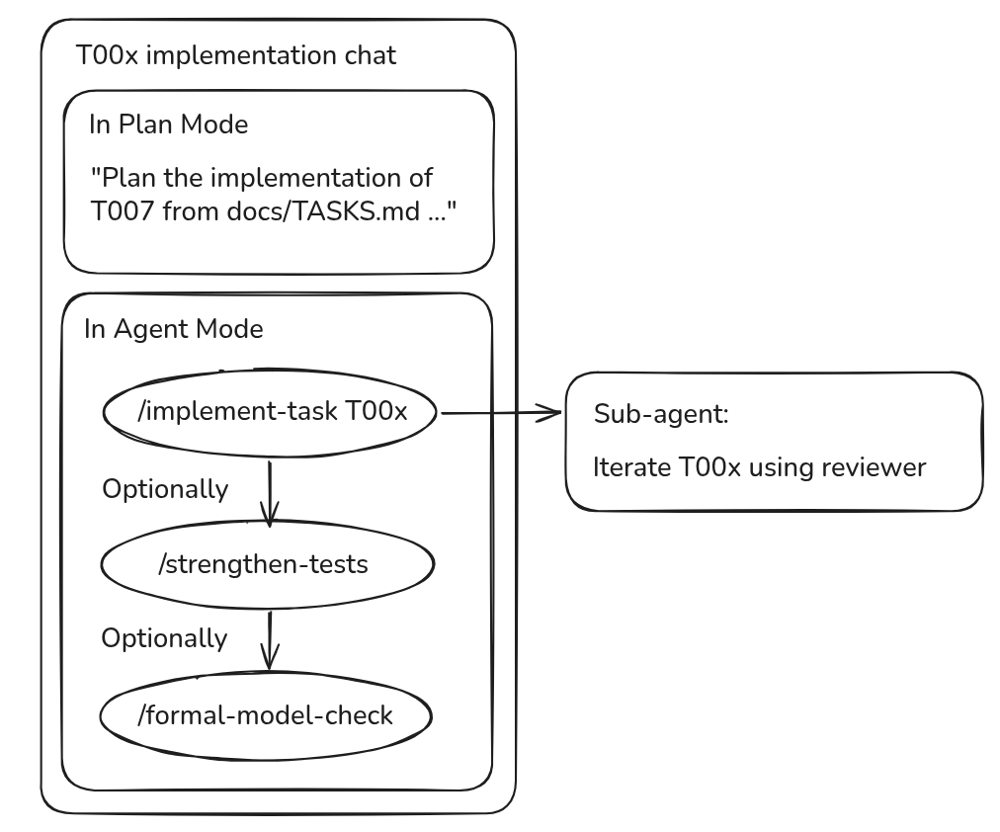

# Agentic Coding Template

## Concepts

**Agent:** An LLM model with tools that you can converse with and instruct to do work.

**Rule:** A chunk of instructions plus metadata that tells Cursor when to add those instructions to an agent's context.

- **`alwaysApply` (`true`/`false`):** Adds the rule to every agent's context when `true`.
- **`description` (string):** Used by Cursor's Apply Intelligently policy. It should tell an agent when to load the full rule body into context.
- **`globs`:** Adds the rule when the agent works with a matching file.

**Skill:** A packaged workflow. When invoked, Cursor attaches its instructions to the current agent, which follows them using its normal tools.

**Sub-agent:** Spawned from a conversation with another agent. It can have:

- **Fresh context:** It does not inherit the parent's entire conversation transcript.
- **Different model:** The parent can specify a model.
- **Different permissions:** The parent can specify permissions, such as read-only access.

## Workflow

The overall workflow moves from specification analysis through architecture, contracts, and task decomposition.

Each implementation task is planned, implemented, and reviewed separately. Test strengthening and formal model checking are optional steps when the task warrants them.

